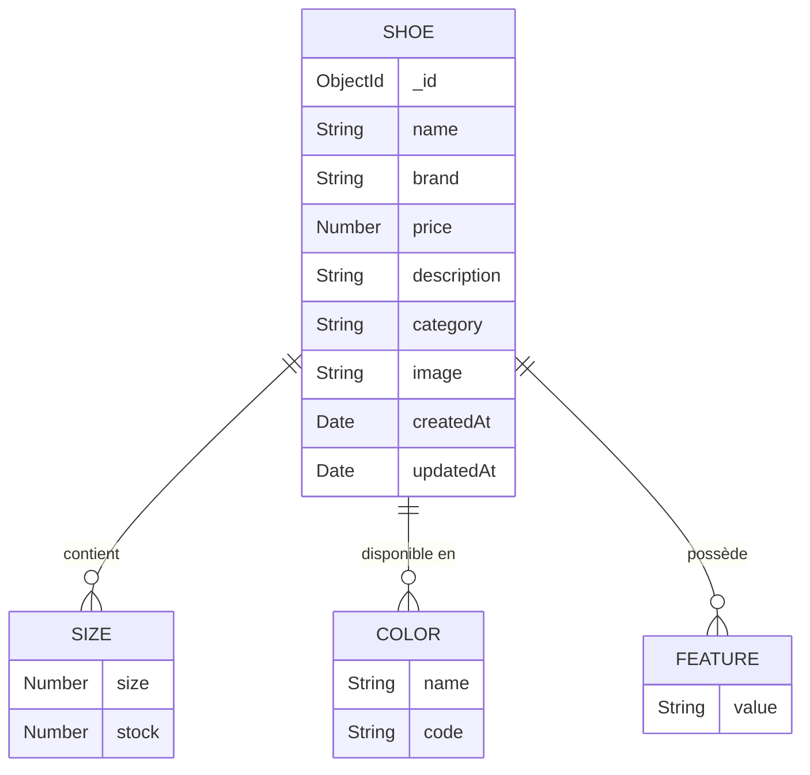

# Diagramme de la Base de Données - ShoeStore

## Structure de la Base de Données



## Description des Collections

### Collection: Shoe
- **`_id`**: Identifiant unique (ObjectId)
- **`name`**: Nom du produit
- **`brand`**: Marque
- **`price`**: Prix en euros
- **`description`**: Description détaillée
- **`category`**: Catégorie (Running, Lifestyle, Sport)
- **`image`**: URL de l'image
- **`createdAt`**: Date de création
- **`updatedAt`**: Date de dernière modification

### Sous-document: Size
- **`size`**: Taille (35-50)
- **`stock`**: Quantité en stock

### Sous-document: Color
- **`name`**: Nom de la couleur
- **`code`**: Code hexadécimal de la couleur

### Sous-document: Feature
- **`value`**: Caractéristique du produit

## Relations

1. **Shoe → Size**
   - Une chaussure peut avoir plusieurs tailles
   - Chaque taille a son propre stock
   - Relation one-to-many

2. **Shoe → Color**
   - Une chaussure peut être disponible en plusieurs couleurs
   - Chaque couleur a un nom et un code
   - Relation one-to-many

3. **Shoe → Feature**
   - Une chaussure peut avoir plusieurs caractéristiques
   - Relation one-to-many

## Exemple de Document

```json
{
  "_id": "ObjectId('...')",
  "name": "Nike Air Max 270",
  "brand": "Nike",
  "price": 159.99,
  "description": "Chaussure de running confortable",
  "category": "Running",
  "image": "https://static.nike.com/...",
  "sizes": [
    {
      "size": 40,
      "stock": 10
    },
    {
      "size": 41,
      "stock": 15
    }
  ],
  "colors": [
    {
      "name": "Noir",
      "code": "#000000"
    },
    {
      "name": "Blanc",
      "code": "#FFFFFF"
    }
  ],
  "features": [
    "Amorti Air Max",
    "Tige en mesh respirant",
    "Semelle en caoutchouc"
  ],
  "createdAt": "2024-03-20T10:00:00Z",
  "updatedAt": "2024-03-20T10:00:00Z"
}
```

## Indexes Recommandés

1. **Index sur `category`**
   - Pour optimiser les recherches par catégorie
   ```javascript
   db.shoes.createIndex({ "category": 1 })
   ```

2. **Index sur `brand`**
   - Pour optimiser les recherches par marque
   ```javascript
   db.shoes.createIndex({ "brand": 1 })
   ```

3. **Index sur `price`**
   - Pour optimiser les recherches par prix
   ```javascript
   db.shoes.createIndex({ "price": 1 })
   ```

4. **Index sur `sizes.size` et `sizes.stock`**
   - Pour optimiser les recherches par taille et stock
   ```javascript
   db.shoes.createIndex({ "sizes.size": 1, "sizes.stock": 1 })
   ```

## Requêtes Courantes

1. **Rechercher tous les produits**
   ```javascript
   db.shoes.find()
   ```

2. **Rechercher par catégorie**
   ```javascript
   db.shoes.find({ "category": "Running" })
   ```

3. **Rechercher les produits en stock**
   ```javascript
   db.shoes.find({ "sizes.stock": { $gt: 0 } })
   ```

4. **Rechercher par fourchette de prix**
   ```javascript
   db.shoes.find({ "price": { $gte: 100, $lte: 200 } })
   ```

5. **Rechercher par taille disponible**
   ```javascript
   db.shoes.find({ "sizes": { $elemMatch: { size: 40, stock: { $gt: 0 } } } })
   ``` 